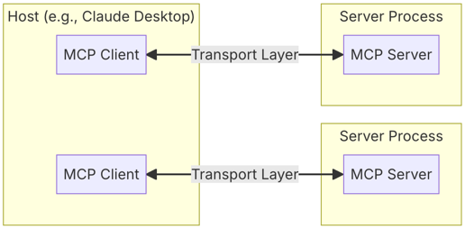
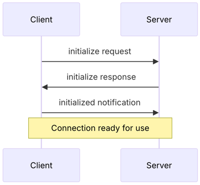

# 1、项目介绍                  
## 1.1、主要内容                                     
本期系列相关视频如下，按照发布的先后顺序:                      
**(第一期)[2024.12.10]Claude重大突破！发布MCP(模型上下文协议)，带你在LLM应用程序脚本中感受它，无需使用Claude Desktop桌面软件，支持类OpenAI风格大模型**               
主要内容:MCP介绍、MCP功能测试,LLM(支持OpenAI接口风格的大模型)应用程序调用MCP               
https://www.bilibili.com/video/BV1HBquYbE7t/                          
https://youtu.be/Jmo7rgb_OXQ                                         
**(第二期)[2024.12.12]Claude MCP应用Text2SQL用例，带你在LLM应用程序中感受它的丝滑，无需使用Claude Desktop桌面软件，支持类OpenAI风格大模型**                   
主要内容:使用MCP实现LLM应用程序Text2SQL功能操纵MySQL数据库                                                     
https://www.bilibili.com/video/BV1ELq4YME8T/                                    
https://youtu.be/yaLAqEMz45A                           
**(第三期)[2024.12.12]Claude MCP应用客户端同时访问和调用多个服务器资源和工具，无需使用Claude Desktop桌面软件，支持类OpenAI风格大模型**           
主要内容:MCP客户端同时访问多个MCP服务器，支持文件系统操作和Text2SQL功能操纵MySQL数据库                       
https://www.bilibili.com/video/BV1oNqaYJEUy/                              
https://youtu.be/tG-ZjOgrcSA                                                                                                                                        
**(第四期)[2024.12.23]DuckDuckGo在线搜索、Fetch内容提取MCP服务器，访问和调用多个服务器资源和工具，支持阿里通义千问大模型、GPT大模型、Ollama本地开源大模型**                  
主要内容:MCP客户端同时访问多个MCP服务器，支持文件系统操作、Text2SQL功能操纵MySQL数据库、在线搜索(DuckDuckGo搜索引擎)和网页内容提取                  
https://www.bilibili.com/video/BV1SckXY3E6S/                            
https://youtu.be/9pzS9saNcGA                        

## 1.2 MCP介绍                             
MCP(模型上下文协议)是Claude开源的一种开放协议，可实现LLM应用程序与外部数据源和工具之间的无缝集成                              
该架构非常简单:开发人员可以通过MCP服务器公开数据，也可以构建连接到这些服务器的AI应用程序(MCP客户端)                  
目前MCP还算是一个测试版，一个本地的服务，运行在你自己的电脑上的                        
MCP官方简介:https://www.anthropic.com/news/model-context-protocol                                                                                  
MCP文档手册:https://modelcontextprotocol.io/introduction                                              
MCP官方服务器列表:https://github.com/modelcontextprotocol/servers                      
PythonSDK的github地址:https://github.com/modelcontextprotocol/python-sdk                          
### (1)PythonSDK版本           
截止当前(12.9),当前的稳定版本为1.1.0                                          
### (2)MCP工作原理                  
MCP遵循客户端-服务器架构(client-server)，其中主机应用程序可以连接到多个服务器                             
                               
**MCP主机(MCP Host):** 是发起连接的LLM应用程序(Claude Desktop、IDE或AI应用等)                                             
**MCP客户端(MCP Client):** 在主机应用程序内部与服务器保持1:1连接                                    
**MCP服务器(MCP Servers):** 服务器向客户端提供上下文、工具和提示词(context, tools, and prompts)                                                           
### (3)核心组件
**Protocol layer 协议层**                           
协议层处理消息帧、请求/响应链接和高级通信模式。关键类:Protocol、Client、Server                                   
**Transport layer 传输层**                         
传输层处理客户端和服务器之间的实际通信                              
Stdio(standard input/output):使用标准输入/输出进行通信                        
SSE(Server-Sent Events):使用服务器发送的事件来发送服务器到客户端的消息                         
所有传输都使用JSON-RPC2.0 来交换消息                         
**Message types 消息类型**            
Requests:请求期望来自另一方的响应                       
Notifications:通知是一种不期望响应的单向消息                    
Results:结果是对请求的成功响应                          
Errors:错误表明请求失败                         
### (4)连接生命周期
**Initialization 初始化**                
                
客户端发送带有协议版本和功能的initialize请求                                         
服务器响应其协议版本和功能                     
客户端发送initialized通知作为确认                                   
正常消息交换开始                        
**Message exchange 消息交换**                  
初始化后，支持以下模式:                        
请求-响应(Request-Response)：客户端或服务器发送请求，对方响应                       
通知(Notifications)：任何一方发送单向消息                      
**Termination 终止**                 
定义了这些标准错误代码:                
ParseError = -32700                     
InvalidRequest = -32600                         
MethodNotFound = -32601                        
InvalidParams = -32602                           
InternalError = -32603                        
### (5)核心功能
**Resources 资源**             
资源是模型上下文协议 (MCP) 中的核心功能，允许服务器公开可供客户端读取并用作LLM交互上下文的数据和内容                 
File contents 文件内容             
Database records 数据库记录            
API responses API 响应               
Live system data 实时系统数据               
Screenshots and images 屏幕截图和图像             
Log files 日志文件                  
And more 还有更多                  
每个资源都由唯一的 URI 标识，并且可以包含文本或二进制数据                  
**Prompts 提示**             
服务器能够定义可重用的提示模板和工作流程，客户端可以轻松地向用户和LLMs展示这些模板和工作流程。它们提供了一种强大的方法来标准化和共享常见的LLM交互                     
接受动态参数                    
包括资源中的上下文              
指导具体工作流程            
**Tools 工具**           
工具是MCP中的强大功能，工具被设计为LLMs控制的，这意味着工具从服务器公开给客户端，目的是让LLMs能够自动调用它们（有人在循环中授予批准）                                   
工具的关键方面包括:                                    
发现(Discovery):客户端可以通过tools/list端点列出可用的工具                             
调用(Invocation):使用tools/call端点调用工具，服务器在其中执行请求的操作并返回结果                                   
灵活性(Flexibility):工具范围从简单的计算到复杂的API交互               
**Sampling 采样**               
采样是一项强大的MCP功能，允许服务器通过客户端请求LLM完成，从而在保持安全和隐私的同时实现复杂的代理行为                      
服务器向客户端发送sampling/createMessage请求                       
客户端审查请求并可以修改它             
LLM采样的客户端样本           
客户端审核完成情况              
客户端将结果返回给服务器                      
这种人机交互设计可确保用户保持对LLM所看到和生成的内容的控制                        
**Transports 传输**                     
MCP的传输为客户端和服务器之间的通信提供了基础。传输处理消息发送和接收的底层机制               
MCP使用JSON-RPC 2.0作为其格式。传输层负责将MCP协议消息转换为JSON-RPC格式进行传输，并将接收到的JSON-RPC消息转换回MCP协议消息           

# 2、前期准备工作
## 2.1 集成开发环境搭建  
anaconda提供python虚拟环境,pycharm提供集成开发环境                                              
**具体参考如下视频:**                        
【大模型应用开发-入门系列】03 集成开发环境搭建-开发前准备工作                         
https://youtu.be/KyfGduq5d7w                     
https://www.bilibili.com/video/BV1nvdpYCE33/                      

## 2.2 大模型LLM服务接口调用方案
(1)gpt大模型等国外大模型使用方案                  
国内无法直接访问，可以使用代理的方式，具体代理方案自己选择                        
这里推荐大家使用:https://nangeai.top/register?aff=Vxlp                        
(2)非gpt大模型方案 OneAPI方式或大模型厂商原生接口                                              
(3)本地开源大模型方案(Ollama方式)                                              
**具体参考如下视频:**                                           
【大模型应用开发-入门系列】04 大模型LLM服务接口调用方案                    
https://youtu.be/mTrgVllUl7Y               
https://www.bilibili.com/video/BV1BvduYKE75/                             

# 3、项目初始化
## 3.1 下载源码
GitHub或Gitee中下载工程文件到本地，下载地址如下：                
https://github.com/NanGePlus/MCPTest                                                                    
https://gitee.com/NanGePlus/MCPTest                                                              

## 3.2 构建项目
使用pycharm构建一个项目，为项目配置虚拟python环境                       
项目名称：MCPTest                          
虚拟环境名称保持与项目名称一致                           

## 3.3 将相关代码拷贝到项目工程中           
将下载的代码文件夹中的文件全部拷贝到新建的项目根目录下                             

## 3.4 安装项目依赖                            
新建命令行终端，在终端中运行 pip install -r requirements.txt 安装依赖                                                      
**注意:** 建议先使用要求的对应版本进行本项目测试，避免因版本升级造成的代码不兼容。测试通过后，可进行升级测试                
     

# 4、功能测试
## 4.1 (第一期)[2024.12.10]测试步骤
**核心演示示例介绍:Filesystem 使用官方提供的文件操作MCP服务器**                                       
**描述:** 提供文件系统操作功能，包括读写文件、目录管理和文件搜索                 
**资源:** file://system 文件系统资源URI                                   
**工具:** read_file, write_file, create_directory, list_directory, move_file, search_files, get_file_info                
read_file:读取文件内容，参数:path (文件路径)                 
read_multiple_files:读取多个文件内容，参数:paths (文件路径数组)              
write_file:创建或覆写文件，参数: path (文件路径), content (文件内容)                           
create_directory:创建目录，参数: path (目录路径)                              
list_directory:列出目录内容，参数: path (目录路径)                          
move_file:移动/重命名文件，参数: source (源路径), destination (目标路径)                                
search_files:递归搜索文件，参数: path (起始路径), pattern (搜索模式)                               
get_file_info:获取文件元数据，参数: path (文件路径)                          
对应的链接:https://github.com/modelcontextprotocol/servers/tree/main/src/filesystem                 
**代码目录**                  
脚本放置在nangeAGICode/basic、filesystem_basic、filesystem_chat目录内,运行对应脚本进行测试         
**测试内容:**        
我当前可以访问哪个文件夹                                              
帮我创建一个test文件夹                                         
帮我在test文件夹下创建一个文件test1.txt，内容为：南哥AGI研习社。                                                    
把test1.txt中的内容agi改大写AGI。                                            
   
## 4.2 (第二期)[2024.12.12]测试步骤
**核心演示示例介绍:Text2SQL 自定义操纵MySQL数据库的MCP服务器**                                                    
**描述:** 提供Text2SQL功能操纵MySQL数据库                                      
**资源:** mysql://{table[0]}/data 数据库表资源URI                                       
**工具描述:** execute_sql                              
execute_sql: 运行SQL脚本，参数:query (SQL语句)           
**代码目录**                  
脚本放置在nangeAGICode/mysql_chat目录内,运行对应脚本进行测试                 
提供LLM对MySQL数据库操作功能，增、删、改、查                                                        
**测试内容:**         
(1)列举可用资源                                   
当前可以访问哪些数据表            
(2)获取某资源内容                             
获取nange_agi这个表的内容            
(3)列举可用的工具                                                
当前可以使用哪些工具                        
(4)查询                                             
调用工具获取nange_agi这个表的内容                            
(5)增加                                           
随机帮我增加一条数据           
调用工具获取nange_agi这个表的内容      
(6)修改                               
新增的那条数据把名称改为test             
调用工具获取nange_agi这个表的内容      
(7)删除                                        
把刚新建的那条数据删除                                 
调用工具获取nange_agi这个表的内容                     
(8)统计数据量                                             
这张表中一共几条数据                                      
   
## 4.3 (第三期)[2024.12.12]测试步骤
**核心演示示例介绍:MCP客户端访问多个MCP服务器**                                                       
**描述:** 结合前面两期的内容，对Filesystem和Text2SQL服务器进行融合使用                   
**代码目录**                      
脚本放置在nangeAGICode/mysql_filesystem_chat目录内,运行对应脚本进行测试    
**测试内容:**                          
当前可以访问哪些资源                           
当前可以访问哪些表                            
当前可以使用哪些工具                            
创建一个test文件夹                              
在test文件夹下创建一个文件test1.txt，内容为：用户名:NanGe003，密码：6543217890，内容：南哥AGI研习社++。                         
获取nange_agi这个表的内容                              
增加一条数据，数据内容为刚刚创建的test1.txt中的内容                                    
获取nange_agi这个表的内容                                    
这张表中一共几条数据                               
新增的那条数据把名称改为test                                       
获取nange_agi这个表的内容                                  
把刚新建的那条数据删除                                    
获取nange_agi这个表的内容                                

## 4.4 (第四期)[2024.12.23]测试步骤
**核心演示示例介绍:在线搜索及获取链接内容 自定义在线搜索DuckDuckGo的MCP服务器及官方fetch MCP服务器**                                                                            
**描述:** 提供在线搜索，并提前搜索结果中有关网页链接内容的提取和总结                                                                                          
**工具描述:** duckduckgo_web_search、fetch                                                                               
duckduckgo_web_search: 执行在线搜索，参数:query(搜索关键词);参数:max_results(最大返回内容数量)                                  
fetch:从互联网获取 URL 并将其内容提取为markdown,参数:url(链接地址);参数:max_length(返回的最大字符数,默认值:5000);raw(获取原始内容而不进行Markdown转换,默认:false)                                         
**代码目录**                       
脚本放置在nangeAGICode/search_mysql_filesystem_chat目录内,运行对应脚本进行测试                              
**测试内容:**                                       
当前可以访问哪些资源                                                                          
当前可以使用哪些工具                                                        
搜索2024年有关AI的最新进展，内容要以中文输出，列出10条，且需要带上相关的链接                                                                        
将这些内容写入到test.txt文件                                                                             
获取第一条链接中的内容并进行总结                                                                             
